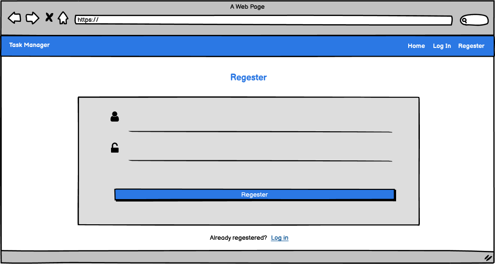

# Task Manager App!

Task Manager demonstrates my skills in Data Centric Development. This application performs create, read, update, and delete calls, otherwise known as CRUD calls, to a MongoDb database.
All built with a micro web framework called Flask. Users will be able to register, see their profile, log out, and log back in again. Registered users will be able to add a new task, 
which includes selecting a due date using Materialize's datepicker component, and toggle a swich to mark the task as urgent. Users will also be able to edit tasks, but will only be permitted 
to edit and or delete their own tasks, not any of the tasks submitted by others.

Using one of Flask's dependencies, I have added security through rudimentary user authentication and authorization.

------
## Languages/Frameworks used
- HTML5
- CSS3
- Bootstrap
- Python3
- Flask

## Database
- MongoDb

## Requirements
```
click==7.1.2
dnspython==2.0.0
Flask==1.1.2
Flask-PyMongo==2.3.0
itsdangerous==1.1.0
pymongo==3.11.2
Werkzeug==1.0.1
```

## Deployment/Activation
Github pages doesn't really like flask designed sites.. So I used Heroku!

Installing Flask
```
gitpod /workspace/task-manager-app $ pip3 install Flask
```
Starting Flask
```
gitpod /workspace/task-manager-app $ python3 app.py
```
Installing PyMongo
```
gitpod /workspace/task-manager-app $ pip3 install Flask-PyMongo
```
Installing Heroku
```
gitpod /workspace/task-manager-app $ npm install -g heroku
```
Heroku Login
```
gitpod /workspace/task-manager-app $ heroku login -i
```
```
heroku: Enter your login credentials
Email: randyaajrsp@gmail.com
Password: *****************
Logged in as randyaajrsp@gmail.com
```

## User Stories
> Marcela Estay<br>
> *Very useful application. I find the user interface to be extremely (new) user friendly.*

> Ronda Lee<br>
> *Task Manager has helped me with keeping uptodate with my daily tasks. Very easy to get started with, much like Facebook and or Twitter.* 

> Micheal Opal<br>
> *This has been my go to for keeping track of my studies. Highly recommend!!* 


## WireFrames
**Home Page** <br>
*Here is where all users can see which tasks are still needed to completed:*
 <br>

**Registration Page** <br>
*All new users will need to register to add their own tasks:*
 <br>

**Add Task Page** <br>
*Authorized user may add their new tasks here:*
 <br>

**Manage Tasks Page** <br>
*Authorized admin users can edit/delete tasks:*
 <br>

## Live Link (Heroku)
[Task Manager](https://task-manager-randy.herokuapp.com/get_tasks)